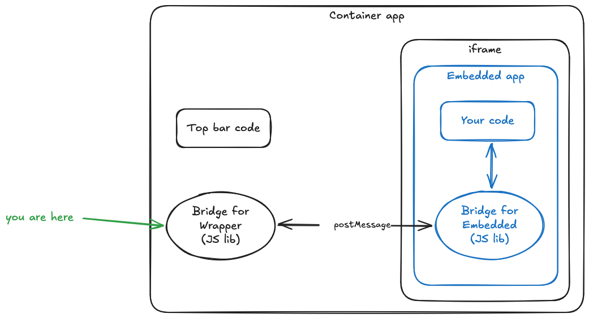

# cozy-external-bridge-container

This library allows communication between a container app and an app embedded in an iframe. It is used with [cozy-twakechat](https://github.com/cozy/cozy-twakechat/) and [cozy-twakemail](https://github.com/cozy/cozy-twakemail/).

This is the container lib. You can also check the [embedded lib](https://github.com/linagora/cozy-libs/tree/master/packages/cozy-external-bridge).



## Setup

```bash
npm install cozy-external-bridge-container
```

```bash
yarn add cozy-external-bridge-container
```

## Usage

Add the `useExternalBridge` hook and it will :

- allow history syncing
- expose a `getContacts` method
- expose a `getFlag` method

```jsx
import { useExternalBridge } from 'cozy-external-bridge-container'

const App = () => {
  const { isReady, urlToLoad } = useExternalBridge('https://chat.twake.app')
}
```

You also need to manage routing if embedded app use history syncing :

```jsx
<HashRouter>
  <Routes>
    <Route element={<AppLayout />}>
      <Route path="/" element={<OutletWrapper Component={App} />}>
        <Route path="bridge/*" />
      </Route>
    </Route>
  </Routes>
</HashRouter>
```
