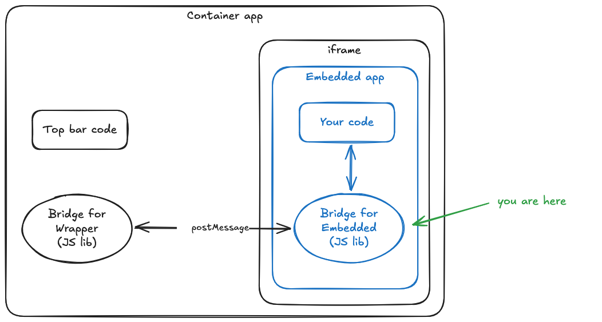

# cozy-external-bridge

This library allows communication between a container app and an app embedded in an iframe. It is used with [cozy-twakechat](https://github.com/cozy/cozy-twakechat/) and [cozy-twakemail](https://github.com/cozy/cozy-twakemail/)

This is the embedded lib. You can also check the [container lib](https://github.com/linagora/cozy-libs/tree/master/packages/cozy-external-bridge-container).



## Setup

Import `dist/bundle.js` script.

## Usage

When imported, it exposes methods in `window._cozyBridge`.

At first, you have the following methods in `window._cozyBridge` :

- `requestParentOrigin: () => Promise<string | undefined>` : request origin from parent iframe; returns undefined if not in an iframe or no answer from iframe
- `isInIframe: () => boolean` : check if inside an iframe
- `isInsideCozy: (targetOrigin: string) => boolean` : \[DEPRECATED] check if target origin is a Cozy origin
- `setupBridge: (targetOrigin: string) => boolean` : setup bridge to communicate with target origin

After setupping bridge, you have the following methods in `window._cozyBridge` :

- `startHistorySyncing: () => void` : start sending history updates to parent window
- `stopHistorySyncing: () => void` : stop sending history updates to parent window
- `getLang: () => Promise<string>` : get lang from parent window
- `getContacts: () => Promise<IOCozyContact[]>` : get contacts from parent window
- `getFlag: (key: string) => Promise<string | boolean>` : get flags from parent window

### How to determine the target origin?

The bridge simplifies data exchange to a parent window. If not used properly, it enables an evil app to leak data from your app. That's why you must setup the bridge correctly by using a SAFE target origin. Here are some ways to setup the bridge properly.

#### Method 1: Specify the safe target origin directly

You know the URL of the container app? Or you are able to build it? In this case, the setup is easy:

```javascript
const mySafeTargetOrigin = 'https://my-safe-container-app.com'

if(window._cozyBridge.isInIframe()) {
  window._cozyBridge.setupBridge(mySafeTargetOrigin)

  // bridge safe and ready ✅
} else {
  // no bridge ❌
}
```

#### Method 2: Check the parent origin

In some case, you may want to be able connect to multiple parent app. In this case, you can leverage the `window._cozyBridge.requestParentOrigin()` method:

```javascript
// check the parent origin e.g. with an allow list
const myParentOriginCheck = (parentOrigin) => {
  if (MY_ALLOW_LIST.includes(parentOrigin)) {
    return true
  }

  return false
}

if(window._cozyBridge.isInIframe()) {
  const parentOrigin = await window._cozyBridge.requestParentOrigin()

  if(myParentOriginCheck(parentOrigin)) {
    window._cozyBridge.setupBridge(parentOrigin)

    // bridge safe and ready ✅
  } else {
  // no bridge ❌
  }
} else {
  // no bridge ❌
}
```

#### In development environment

In **development environment** ⚠️ only ⚠️, you may want to connect to '\*' as target origin:

```javascript
if(window._cozyBridge.isInIframe()) {
  window._cozyBridge.setupBridge('*')

  // bridge unsafe and ready ⚠️
} else {
  // no bridge ❌
}
```
