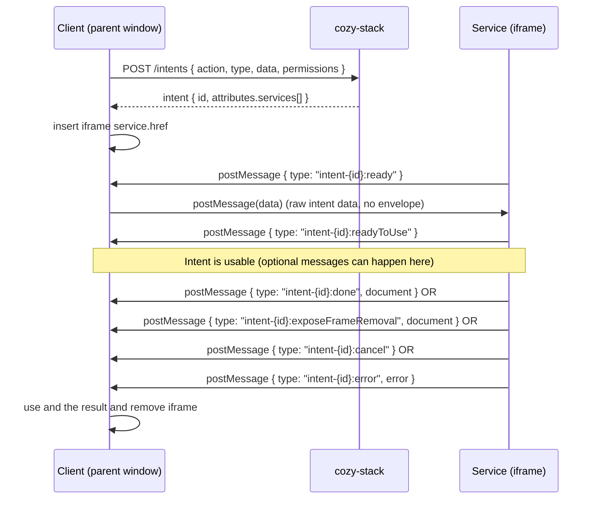

# cozy-interapp

`cozy-interapp` implements Cozy intents. It lets an app (the **client**) ask another app (the **service**) to perform an action it does not have permissions for. The two apps communicate through an `<iframe>` or a `WebView` and `postMessage` and follow a postMessage intent protocol described below. This library helps build a client and a service. You can also implement the postMessage intent protocol yourself.

See [cozy-stack](https://docs.cozy.io/en/cozy-stack/intents/) for more details on Cozy intents.

See [cozy-drive](https://github.com/linagora/twake-drive/blob/master/docs/file-picker-intent.md) for an example intent.

## Usage

### Install

```bash
yarn add cozy-interapp
```

`cozy-interapp` does not depend on React. It needs a way to talk to the
stack: either a `cozy-client` instance or a `fetch` function managing authentication.

### Initialization

With `cozy-client`:

```js
import CozyClient from 'cozy-client'
import Intents from 'cozy-interapp'

const client = new CozyClient({ uri, token })
const intents = new Intents({ client })
```

Without `cozy-client`, pass a `fetch` function with the following signature:

```js
import Intents from 'cozy-interapp'

const fetchJSON = async (method, path, body) => {
  const res = await fetch(`${WORKSPACE_URL}${path}`, {
    method,
    headers: {
      'Content-Type': 'application/json',
      Authorization: `Bearer ${TOKEN}`
    },
    body: body ? JSON.stringify(body) : undefined
  })
  if (!res.ok) throw new Error(await res.text())
  return res.json()
}

const intents = new Intents({ fetch: fetchJSON })
```

See [cozy-ui-plus](https://github.com/linagora/cozy-libs/tree/master/packages/cozy-ui-plus/src/Intent) for ready for use React components using cozy-interapp.

## Guideline to build an intent

### UI lifecycle

The client app is responsible of the UI lifecycle of the intent, e.g.:

- opening the intent
- hiding the intent
- closing the intent

As the service app can not know how client application will display the service, we let the client:

- choose how to display the intent: inside a modal, inside a bottomshet, inside a card, etc
- choose how the user can close it (with a cross button, with a keyboard shortcut, etc) or hide it (with a minimize button, etc), etc

### Error handling

The rule:

- all business errors are managed inside the intent. e.g. with a File Picker: a user selects a file but when the user click on "Share" the file has been deleted => the File Picker manages itself the error. It displays an error message and let the user try again or select another file or close the File Picker if it does not make sense anymore, etc. There is not interest to forward this kind of errors to the client app because it will not know what to do with these business errors.
- technical errors are forwarded to the client in an `error` message. The client app can decide what it does: try again, display an error message saying the service is unavailable, ...

It is recommanded that the client app wait the `ready`message with a timeout >= 10 seconds in case the intent crash. In this case, it must consider this as a technical error.

## postMessage intent protocol overview

### Roles

| Role | Where it runs | What it does |
|---|---|---|
| **Client** | The calling app (top window) | Creates the intent via the stack, inserts the iframe, listens for messages, resolves a promise with the result. |
| **Service** | The serving app (inside the iframe) | Receives intent data, renders UI, sends back `done` / `cancel` / `error` / `resize` / ... messages. |
| **Stack** | `cozy-stack` | `POST /intents` creates the intent, returns the list of matching services and `availableApps`. `GET /intents/:id` is used by the service to retrieve the intent. |

The stack returns the list of services that can handle the intent. The client picks one and loads its `href` in an iframe. The service page runs inside the iframe and talks back to its parent via `postMessage`.

### Sequence diagram



### Messages

All messages from service to client are objects with a `type` field of the form `intent-{intentId}:{subtype}`.

The service sends all those messages via `serviceWindow.parent.postMessage(message, intent.attributes.client)`. The client must listen via `window.addEventListener('message', ...)` and filter by `event.origin === serviceOrigin`.

Errors are serialized: the service sends a plain object with `message` and `name` and the client can reconstruct a `new Error(message)` with the original properties copied back onto it.

#### Core messages

| Direction | `type` (or payload shape) | Fields | Meaning |
|---|---|---|---|
| Service → Client | `intent-{id}:ready` | — | Handshake. Client responds by posting the raw intent `data` back to the service. |
| Client → Service | *(raw `data`, no envelope)* | whatever was passed to `intents.create(action, type, data, ...)` | Sent immediately after `ready`. The service reads it via `service.getData()`. |
| Service → Client | `intent-{id}:readyToUse` | — | The service's UI is rendered and its initial data has loaded. Fires the client's `onReadyToUse` callback. Sent at most once. |
| Client → Service | *(raw `doc`, no envelope)* | the resulting document of the composed intent | Sent back after the composed intent resolves. The service's `compose(...)` promise resolves with it. |
| Service → Client | `intent-{id}:done` | `document` | Successful termination. Client resolves the intent promise with `document`, removes the iframe. |
| Service → Client | `intent-{id}:exposeFrameRemoval` | `document` | Like `done`, but the client keeps the iframe in the DOM and returns `{ document, removeIntentIframe }` so the caller can animate closing before removing the iframe. Only sent when the client passed `exposeIntentFrameRemoval: true` in the intent data. |
| Service → Client | `intent-{id}:cancel` | — | The service cancels. Client resolves the intent promise with `null`, removes the iframe. Also sent automatically on the service's `unload` event if the service was never terminated. |
| Service → Client | `intent-{id}:error` | `error` | Failure. Client rejects the intent promise with a deserialized `Error`. |

#### Optional messages

| Direction | `type` (or payload shape) | Fields | Meaning |
|---|---|---|---|
| Service → Client | `intent-{id}:resize` | `dimensions: { width?, height?, maxWidth?, maxHeight?, element? }`, `transition?: string` | Resizes the element that holds the iframe. `element` is measured client-side by the service and converted to `maxWidth` / `maxHeight`. `transition` is applied as a CSS `transition` property. |
| Service → Client | `intent-{id}:hideCross` | — | Ask the client to hide its close button. Fires `onHideCross`. |
| Service → Client | `intent-{id}:showCross` | — | Ask the client to show its close button. Fires `onShowCross`. |
| Service → Client | `intent-{id}:compose` | `action`, `doctype`, `data` | Ask the client to start a nested intent. The client creates it, hides the current service iframe, runs the nested intent, then posts the resulting document back to the service via `postMessage(doc, origin)`. |

## API reference

### `intents.create()`

`intents.create(action, doctype [, data, permissions])` create an intent. It returns a modified Promise for the intent document, having a custom `start(element)` method. This method interacts with the DOM to append an iframe to the given HTML element. This iframe will provide an access to an app, which will serve a service page able to manage the intent action for the intent doctype. The `start(element)` method returns a promise for the result document provided by intent service.

> **`start` options:** The `start` method takes an optional second argument, an options object: `start(element, options)`. Supported keys:
>
> - `onReady` — called when the intent iframe has finished loading (iframe `onload`). Useful for running client code once the iframe is ready.
> - `onHideCross` / `onShowCross` — called when the service asks the client to hide/show the close button.
> - `onReadyToUse` — called when the service signals it is **truly ready** (UI rendered and initial data loaded), via `service.notifyReadyToUse()`. Distinct from `onReady`, which only signals the iframe loaded. See `intents.createService()` below.

An intent has to be created everytime an app need to perform an action over a doctype for wich it does not have permission. For example, the Cozy Drive app should create an intent to `pick` a `io.cozy.contacts` document. The cozy-stack will determines which app can offer a service to resolve the intent. It's this service's URL that will be passed to the iframe `src` property.

Once the intent process is terminated by service, the iframe is removed from DOM.

You can also use `.then` to run some code after the intents is terminated like following:

#### Example

```js
intents.create('CREATE', 'io.cozy.apps')
  .start()
  .then(intent => {
    // do something with the result of the intent
    // intent = {
    //    id: '1337',
    //    attributes: {...}
    // }
  })
```

Example to use `removeIntentFrame()` method (by passing the flag `exposeIntentFrameRemoval` flag):

```js
intents.create('EDIT', 'io.cozy.apps')
  .start(document.getElementById('intent-service-wrapper'))
  .then({removeIntentFrame, doc} => { // after service.terminate(doc)
      // Code to be run before removing the terminated intent iframe
      removeIntentFrame()
      // Other code, use doc
  })
```

### `intents.createService()`

`intents.createService([intentId, window])` has to be used in the intent service page. It initializes communication with the parent window (remember: the service is supposed to be in an iframe).

If `intentId` and `window` parameters are not provided the method will try to retrieve them automatically.

It returns a *service* object, which provides the following methods :

- `compose(action, doctype, data)`: request the client to make a second intent. This returns a promise fulfilled with the second intent result.

```js
// ...
const app = await service.compose('INSTALL', 'io.cozy.apps', { slug: 'drive' })
```

- `getData()`: returns the data passed to the service by the client.
- `getIntent()`: returns the intent
- `resizeClient(doc, transitionProperty)`: forces the size of the intent modale to a given width, maxWidth, height, maxHeight, or dimensions of a given element. The second optional argument `transitionProperty` can be used to add a CSS transition property on the intent in order to 'animate' the resizing.

  ```js
  // resize the client ot 300 pixels max height
  service.resizeClient({
     maxHeight: 300
  }, '.2s linear') // will be in css -> transition: .2s linear;
  // or
  service.resizeClient({
     element: document.querySelector('.class')
  })
  ```

> **On intent size:** If an intent is used by multiple applications, we don't use resizeClient(), since each application can have his own layout. You have to define the size of the intent in your application

- `terminate(doc)`: ends the intent process by passing to the client the resulting document `doc`. An intent service may only be terminated once.
  > If a boolean `exposeIntentFrameRemoval` is found as `true` in the data sent by the client, the `terminate()` method will return an object with as properties a function named `removeIntentFrame` to remove the iframe DOM node (in order to be run by the client later on) and the resulting document `doc`. This could be useful to animate an intent closing and remove the iframe node at the animation ending.

- `cancel()`: ends the intent process by passing a `null` value to the client. This method terminate the intent service the same way that `terminate()`.

- `throw(error)`: throw an error to client and causes the intent promise rejection.

- `notifyReadyToUse()`: tells the client the service UI is rendered and its initial data has loaded. A service may call this only once; a second call is a no-op with a warning. Throws if called after `terminate()`. The client receives it via the `onReadyToUse` option of `start()`.

#### Example

```js
intents.createService('77bcc42c-0fd8-11e7-ac95-8f605f6e8338', window)
  .then(service => {
    const data = service.getData()

    // [...]
    // Do stuff with data
    // [...]

    const resultingDoc = {
      type: 'io.cozy.photos',
      width: 100,
      height: 100
    }

    service.terminate(resultingDoc)
  })
```

### `intents.getRedirectionURL()`

`intents.getRedirectionURL(doctype, data)` retrieves a redirection URL for a given doctype, with specified data. It relies internally on a regular intent mechanism, which creates an intent for the `REDIRECT` action. It then build the redirection URL from URL sent by the stack and returns it. This URL can be used as link `href` for example, to show the doctype or the document in an application able to handle it.

#### Example

```jsx
  const myFolder = {
    folder: '4bce4649-e7b7-4226-d82e-6b87dbb684e7'
  }

  const url = await intents.getRedirectionURL('io.cozy.files', myFolder)
  // url is http://domain-app.cozy.rocks/#/files?folder=4bce4649-e7b7-4226-d82e-6b87dbb684e7
```

### `intents.redirect()`

`intents.redirect(doctype, data)` is based on `intents.getRedirectionURL()` and it redirects the browser to the retrieved URL.
